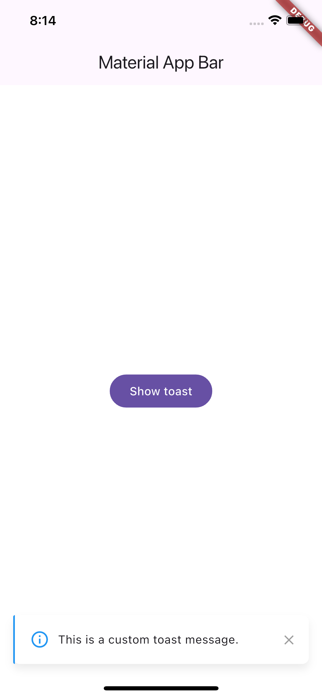

# ToastifyFlutter

The ToastifyFlutter package provides an easy way to display toasts in Flutter applications. Toasts are brief popup messages shown on the screen to inform the user about an action or state in the application.

With ToastifyFlutter, you can display customizable toasts with different durations and positions on the screen. This package simplifies the implementation of toasts in your Flutter application, allowing you to easily integrate informative messages in a visually effective manner.

Key features:

- Display toasts with customizable messages.
- Configure the duration and position of the toast on the screen.
- Seamless integration into Flutter applications to provide user feedback intuitively.

# How to use

```
dependencies:
  toastify_flutter: 2.1.1
 ```


```
import 'package:toastify_flutter/flutter_toastify.dart';
 ```

# Display a Toast
To display a simple toast, use the following code:

```
ToastifyFlutter.success(
  context,
  message: 'This is a custom toast message.',
  duration: 5,
  position: ToastPosition.bottom,
  style: ToastStyle.simple,
  onClose: true,
);
 ```

 # Example

```
import 'package:flutter/material.dart';
import 'package:toastify_flutter/flutter_toastify.dart';

void main() => runApp(const MyApp());

class MyApp extends StatelessWidget {
  const MyApp({super.key});

  @override
  Widget build(BuildContext context) {
    return MaterialApp(
      title: 'ToastifyFlutter',
      home: Scaffold(
        appBar: AppBar(
          title: Text('My App'),
        ),
        body: Center(
          child: ElevatedButton(
            onPressed: () {
              ToastifyFlutter.success(
                context,
                message: 'This is a custom toast message.',
                duration: 5,
                position: ToastPosition.bottom,
                style: ToastStyle.simple,
                onClose: true,
              );
            },
            child: Text('show toast'),
          ),
        ),
      ),
    );
  }
}

```

# Toast success Top

```
ElevatedButton(
  onPressed: () {
    ToastifyFlutter.success(
      context,
      message: 'This is a custom toast message.',
      duration: 5,
      position: ToastPosition.top,
      style: ToastStyle.flat,
      onClose: true,
    );
  },
  child: Text('show toast'),
),
```


# Toast error, info and warning
```
ElevatedButton(
  onPressed: () {
    ToastifyFlutter.error(
      context,
      message: 'This is a custom toast message.',
      duration: 5,
      position: ToastPosition.top,
      style: ToastStyle.flat,
      onClose: true,
    );
  },
  child: Text('show toast'),
),
```


# Toast Bottom

```
ElevatedButton(
  onPressed: () {
    ToastifyFlutter.error(
     context,
              message: 'This is a custom toast message.',
              duration: 5,
              position: ToastPosition.top,
              style: ToastStyle.minimal,
              onClose: true,
    );
  },
  child: Text('show toast'),
),
```


